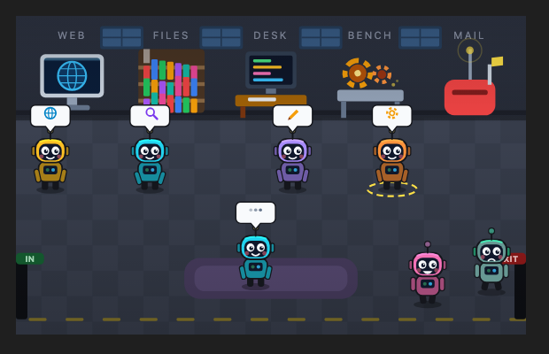

# agent-warehouse

A Claude Code mod (Desktop and terminal) by [Shaheer Shoaib](https://github.com/shaheershoaib): your session's agents as little robots in a warehouse. They walk in when they start, work at the station their tools need, celebrate and walk out when they finish.



## Install

Paste this in a terminal:

```bash
curl -fsSL https://raw.githubusercontent.com/shaheershoaib/agent-warehouse/main/install.sh | bash
```

Then open a new Claude Code session. That's it. Run the same line again any time to update.

It downloads the mod to `~/.claude/mods/agent-warehouse` and adds it to `CLAUDE_CODE_PLUGIN_DIRS` in `~/.claude/settings.json` (your other settings are kept, and a backup is made first). Needs `python3` or `node`, which most machines have.

To remove it:

```bash
curl -fsSL https://raw.githubusercontent.com/shaheershoaib/agent-warehouse/main/uninstall.sh | bash
```

<details>
<summary>Or install from the plugin marketplace</summary>

In Claude Code:

```
/plugin marketplace add shaheershoaib/agent-warehouse
/plugin install agent-warehouse@agent-warehouse
```

Claude Code is still rolling out mods for marketplace plugins. If nothing appears after a new session, use the install line above instead.
</details>

## What it does

- Opens on its own when your first agent starts; `/warehouse` opens it any time.
- Stations: **WEB** (web fetches and MCP tools), **FILES** (reading and searching), **DESK** (edits), **BENCH** (shell commands), **MAIL** (messages and new agents). Agents still thinking wait on the rug.
- Every robot wears its own color, so you can tell them apart even when they are the same kind of agent.
- Letters fly between robots when agents message each other. Finished robots celebrate and leave by the exit; failed ones cry under a rain cloud, and keep crying all the way out. An agent counts as failed when Claude Code reports an error, or when its final answer says it could not do the task (a quick check by Claude's small model reads the answer; one that starts with `FAILED` needs no check).
- Point at or click a robot to see what it is doing right now and the task it was given. Click its name below the scene to keep those details open.

## Good to know

- Requires a Claude Code build with mods (2.1.286 or later). Tested on macOS; `install.sh` works on macOS and Linux.
- Everything runs locally in Claude Code; nothing is sent anywhere.
- Claude Desktop reloads a mod's pictures whenever its panel updates, so the warehouse can blink briefly when an agent starts, finishes or changes station.
- Pairs with [usage-meter](https://github.com/shaheershoaib/usage-meter), which shows your live usage above the prompt and requests more from your admins.

## License

[Apache 2.0](LICENSE): free to use, modify, and share, including commercially. Keep the [`NOTICE`](NOTICE) file with any redistribution (§4(d)), and don't market a fork under the `agent-warehouse` name (§6). The patent grant in §3 means adopting this doesn't expose you to a patent claim over it.

Required Notice: Copyright Shaheer Shoaib (https://github.com/shaheershoaib)
